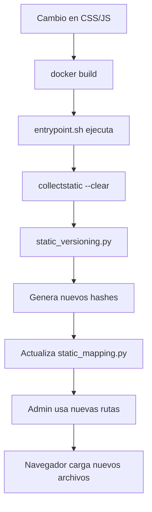

# Sistema de Versionado Automático de Archivos Estáticos

## Descripción

Este sistema resuelve definitivamente los problemas de caché de archivos CSS y JS en el panel de administración de Django cuando se ejecuta en Docker.

## Características

### ✅ Versionado Automático

- Genera hash MD5 basado en el contenido del archivo
- Crea archivos versionados con nombres únicos (ej: `custom_admin_v1dc28ac9.css`)
- Limpia automáticamente versiones antiguas

### ✅ Mapeo Dinámico

- Genera `utils/static_mapping.py` con mapeo de archivos
- Función helper `get_versioned_asset()` para referencias dinámicas
- Actualiza automáticamente todos los archivos `admin.py`

### ✅ Integración con Docker

- Se ejecuta automáticamente en el entrypoint del contenedor
- Compatible con desarrollo local y producción
- No requiere intervención manual

## Archivos del Sistema

```
backend/
├── utils/
│   ├── static_versioning.py          # Script principal de versionado
│   ├── static_mapping.py             # Mapeo generado automáticamente
│   └── management/commands/
│       └── version_static_assets.py  # Comando Django
├── static/admin/
│   ├── css/custom_admin.css          # CSS fuente
│   └── js/
│       ├── vehiculos_admin.js        # JS de vehículos
│       ├── politicas_admin.js        # JS de políticas
│       ├── usuarios_admin.js         # JS de usuarios
│       ├── payments_admin.js         # JS de pagos
│       └── reservas_admin.js         # JS de reservas
├── staticfiles/admin/                # Archivos versionados
├── entrypoint.sh                     # Entrypoint optimizado
├── force_static_update.sh           # Script manual Linux/Mac
└── force_static_update.bat          # Script manual Windows
```

## Funcionamiento

### 1. Generación Automática

El sistema se ejecuta automáticamente:

- Al construir el contenedor Docker
- Al reiniciar el contenedor
- Al ejecutar `collectstatic`

### 2. Proceso de Versionado

1. **Análisis**: Lee el contenido de cada archivo CSS/JS
2. **Hash**: Genera hash MD5 único basado en contenido
3. **Copia**: Crea archivo versionado con hash en el nombre
4. **Limpieza**: Elimina versiones antiguas (mantiene las 2 más recientes)
5. **Mapeo**: Actualiza `static_mapping.py` con nuevas referencias
6. **Actualización**: Modifica todos los `admin.py` para usar nuevas rutas

### 3. Referencias Dinámicas

Los archivos `admin.py` usan referencias dinámicas:

```python
from utils.static_mapping import get_versioned_asset

class MyAdmin(admin.ModelAdmin):
    class Media:
        css = {
            'all': (get_versioned_asset("css", "admin/css/custom_admin.css"),)
        }
        js = (get_versioned_asset("js_vehiculos", "admin/js/vehiculos_admin.js"),)
```

## Archivos Incluidos

### CSS Principal

- **custom_admin.css**: Estilos modernos para el panel de administración
  - Variables CSS para consistencia
  - Diseño responsive
  - Colores corporativos de Mobility4You
  - Mejoras de UX para usuarios no técnicos

### JavaScript por Módulo

- **vehiculos_admin.js**: Funcionalidades para gestión de vehículos
- **politicas_admin.js**: Editor de políticas y términos
- **usuarios_admin.js**: Gestión avanzada de usuarios
- **payments_admin.js**: Procesamiento de pagos y reembolsos
- **reservas_admin.js**: Sistema de reservas y calendario

## Comandos Disponibles

### Versionado Manual

```bash
# Desde el contenedor
python utils/static_versioning.py

# Como comando Django
python manage.py version_static_assets

# Script completo (Linux/Mac)
./force_static_update.sh

# Script completo (Windows)
force_static_update.bat
```

### Limpieza

```bash
# Solo limpiar archivos antiguos
python manage.py version_static_assets --clean-only
```

## Ventajas de esta Solución

### 🚀 Rendimiento

- Los archivos versionados permiten caché agresivo del navegador
- Solo se descargan cuando el contenido cambia realmente
- Menor tiempo de carga en visitas posteriores

### 🛡️ Confiabilidad

- Hash basado en contenido garantiza unicidad
- No depende de timestamps o versiones manuales
- Funciona tanto en desarrollo como en producción

### 🔧 Mantenimiento

- Completamente automático
- No requiere intervención manual
- Limpieza automática de archivos antiguos

### 📱 Compatibilidad

- Funciona con todos los navegadores modernos
- Compatible con CDNs y proxies de caché
- No afecta el funcionamiento de Django

## Flujo en Producción



## Resolución de Problemas

### Si los estilos no se actualizan:

1. Verificar que el script se ejecuta en el entrypoint
2. Comprobar permisos de escritura en `staticfiles/`
3. Ejecutar manualmente: `python utils/static_versioning.py`

### Si hay errores de importación:

1. Verificar que `utils/static_mapping.py` existe
2. Regenerar con: `python utils/static_versioning.py`
3. Verificar sintaxis en archivos `admin.py`

### Para desarrollo local:

```bash
# Ejecutar versionado local
cd backend
python utils/static_versioning.py

# O usar el comando Django
python manage.py version_static_assets
```

## Notas Importantes

- ✅ **Automatización Completa**: No requiere intervención manual en producción
- ✅ **Cache Busting Efectivo**: Garantiza que los cambios se reflejen inmediatamente
- ✅ **Performance Optimizada**: Permite caché agresivo del navegador
- ✅ **Desarrollo Friendly**: Funciona tanto local como en Docker
- ✅ **Backwards Compatible**: Fallback a nombres originales si falla el versionado

Este sistema elimina definitivamente los problemas de caché de archivos estáticos en el admin de Django, proporcionando una solución robusta y automática para el proyecto Mobility4You.
